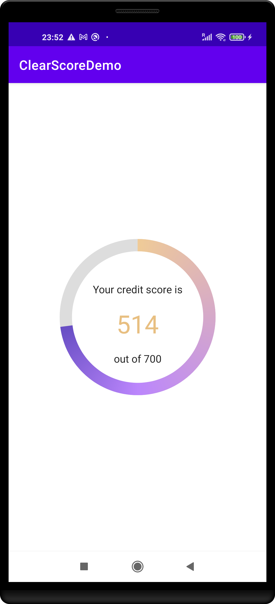
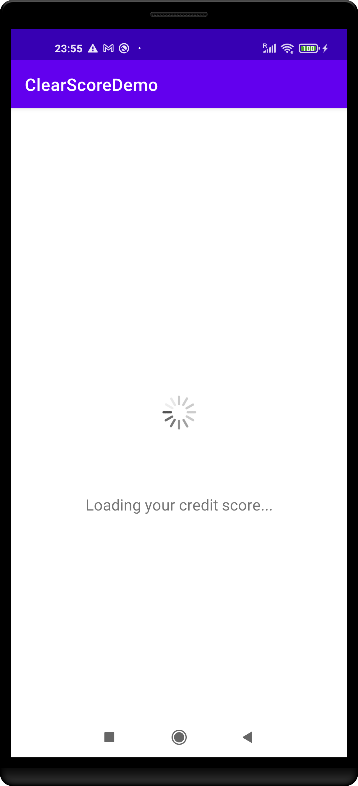
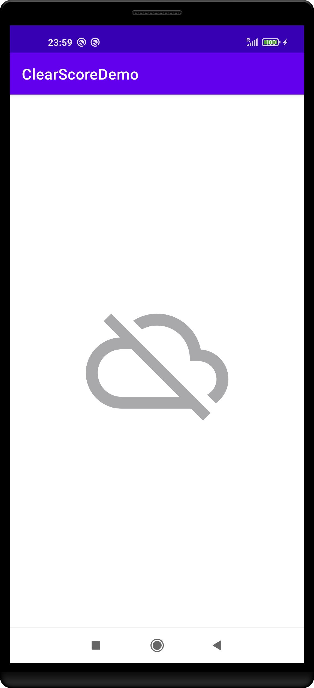

# CreditScore
The CreditScore developed using MVVM architecture on Kotlin. I've used [this api](https://android-interview.s3.eu-west-2.amazonaws.com/endpoint.json) to fetch credit score

```
{
  "accountIDVStatus": "PASS",
  "creditReportInfo": {
    "score": 514,
    "scoreBand": 4,
    "maxScoreValue": 700,
    ...
  }
}      
```
Used `score` and `maxScoreValue` fields shows Credit Score on the UI

## Libraries Used
- **Foundation** 🎯
1. AppCompat
2. Android KTX
3. Test
- **Architecture** 🛠
1. View Binding
2. Lifecycles
3. LiveData
4. ViewModel
- **UI** 🔮
1. Fragment
2. Layout
- **Third party** 🖇
1. Retrofit for fetching data
2. Kotlin Coroutines for managing background threads with simplified code and reducing needs for callbacks
3. Dagger Hilt for dependency injection

## Tests 🔍
I've tested these cases in my project;
1. Does credit score api service call when loadCreditScore() function call?
2. Is the status be done when credit score api service return success?
3. Is the status be done when credit score api service return error?
4. When loadCreditScore() is called progress value should be calculate correct?


## Screenshots 📸

<p align="center">

</p>

